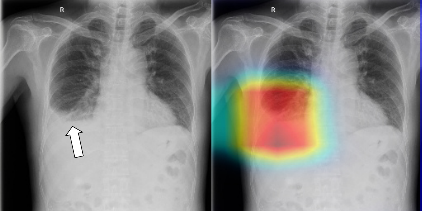

# 胸片疾病筛查项目总结

## 代码路径：
http://172.16.0.128/data/VPS/VPS_04/jjdmk/chexnet_pytorch

## 一. 技术栈

### 框架和库：
[requirements.txt](./requirements.txt)

### 项目结构：
    ├── configs
    │   ├── path_configs.json      (设置路径文件)
    ├── data                       (交叉验证数据集)
    ├── snapshot_path              (模型保存路径)
    ├── images                     (README.md图片路径)
    ├── src                        (训练和预测的代码)
    │   ├── inceptionv3_5k         (在六院数据上预训练的模型)
    │   ├── dataset                (读取数据代码)
    │   ├── models                 (模型代码)
    │   ├── train_model_10_class.py(用六院数据和chexpert数据训练模型)
    │   ├── train_model_25_class.py(用六院数据训练模型)
    │   ├── train_model_chexpert.py(用chexpert数据训练模型)
    │   ├── inference.py           (预测和生成热力图)
    │   ├── inference_cpu.py       (在cpu上预测)
    │   ├── inference_gpu.py       (在gpu上预测)
    │   ├── inference.ipynb        (在notebook上预测)
    ├── README.md
    └── requirements.txt


### 数据目录：
```
/data/raw_data_repository/chestXray
```
包含六院数据90k例 和cheXpert 200k例

- chext_expert_local_10_classes.csv 为六院数据和cheXpert数据合并得到的10个类的标签
其中var_0到var_9对应的标签为不张，实变，心影增大，气胸，肺水肿，肺内占位，肺炎，胸腔积液，骨折。
- cleaned_report_25_classes_extraction.csv 为六院数据的25个类的标签
其中var_0到var_24对应的标签为气胸，肺气肿，肺内钙化，PICC， 动脉弓迂曲，动脉弓钙化，动脉异常，小片影，心影增大，斑片影，肺内阴影，空洞，肺内占位，肺纹理增多，水肿，肺结节，肺门异常，胸腔积液，胸膜增厚，胸膜粘连，胸膜钙化，胸膜异常，脊柱侧弯，起搏器植入后，间质改变。

> chexpert
  >+ chexpert (cheXpert 数据)
  >+ local_data (六院数据)
  >+ all_png_512 (cheXpert + 六院数据)

## 二. 业务部分

### 项目背景
X线胸片，通俗地被称为“拍片”，也列为常规体检的检查项目之一。X线摄影的快捷、简便、经济的优势日渐突出，成为胸部检查的优先选择。
X线胸片能清晰地记录肺部的大体病变，如肺部炎症、肿块、结核等。X线摄片利用人体组织的不同密度可观察到厚度和密度差别较小部位的病变。相比胸部透视，X线胸片显像更清楚，能发现细微的病变；影像资料的客观记录有利于疾病诊治的复查对比；患者接受透视的射线剂量也相对更大。

### 项目计划目标
目标：根据胸部X-ray图片检测多种检查所见，并做出相应类别关注区域的热力图。

### 实施路径和方法
- 1). 用深度卷积神经网络训练多标签分类模型
- 2). 用grad-cam方法做出类别的关注区域热力图

#### 数据准备
所用数据包含六院数据和cheXpert数据，其中六院数据包含25个类的检查所见，cheXpert数据包含10个类的检查所见
#### 模型
用densenet121作为基础网络训练了两个模型：1，只用六院数据训练25个类别的多标签分类模型，2，混合六院数据和cheXpert数据训练10个类别的多标签分类模型
#### 评价指标
分类metrics 为auc 和 f1 score

### 结果

|Abnormality label| CNN |Local radiologists|    Difference| Advantage
|  ----  | ----  | ----  | ----  | ----  |
|Consolidation| 0.935 (0.908-0.955) |0.927 (0.899-0.948)|   0.8%|   Near
|Small consolidation|   0.833 (0.795-0.865) |0.917 (0.887-0.939)|   -8.4%|  Radiologists
|Patchy consolidation   |0.954 (0.930-0.970)|   0.961 (0.938-0.976) |-0.7%| Near
|Nodule |0.930 (0.903-0.951)    |0.935 (0.908-0.955)    |-0.5%| Near
|Calcification| 0.858 (0.823-0.888) |0.938 (0.911-0.957)|   -7.9%|  Radiologists
|Mass|  0.974 (0.955-0.986)|    0.997 (0.987-1.000)|    -2.3%|  Near
|Interstitial involvement|  0.991 (0.976-0.996) |0.987 (0.971-0.994)    |0.4%|  Near
|Cavity |0.935 (0.908-0.955)|   1.000 (0.991-1.000) |-6.5%| Radiologists
|Hilar adenopathy   |0.961 (0.938-0.975)|   0.953 (0.929-0.969) |0.7%|  Near
|Emphysema| 0.974 (0.955-0.986)|    0.971 (0.951-0.983)|0.3%    |Near
|Pulmonary Edema    |0.882 (0.848-0.909)|   1.000 (0.991-1.000) |-11.8%|    Radiologists
|Prominent bronchovascular marking  |0.882 (0.848-0.909)|   0.958 (0.935-0.974)|    -7.7%|  Radiologists
|Cardiomegaly|  0.882 (0.848-0.909) |0.855 (0.818-0.885)|   2.7%|   Near
|Aortic abnormalities|  0.856 (0.820-0.886) |0.852 (0.815-0.882)    |0.4%|  Near
|Aortic unfolding|  0.977 (0.958-0.987) |0.971 (0.951-0.983)|   0.5%|   Near
|Aortic arteriosclerosis    |0.856 (0.820-0.886)|   0.849 (0.813-0.880) |0.7%   |Near
|Pneumothorax|  0.970 (0.949-0.982) |0.984 (0.968-0.993)|   -1.5%|  Near
|Pleural effusion|  0.970 (0.949-0.982) |0.945 (0.920-0.963)    |2.4%|  Near
|Pleural abnormalities| 0.766 (0.724-0.803) |0.784 (0.743-0.820)|   -1.9%|  Near
|Pleural thickening |0.768 (0.726-0.805)|   0.784 (0.743-0.820)|    -1.6%|  Near
|Pleural adhesion|  0.986 (0.970-0.994) |0.984 (0.968-0.993)|   0.2%|   Near
|Pleural calcification| 0.988 (0.973-0.995)|    0.987 (0.971-0.994) |0.1%|  Near
|Scoliosis| 0.754 (0.711-0.792) |0.686 (0.641-0.728)|   6.8%|   CNN
|PICC implant|  0.754 (0.711-0.792)|    0.979 (0.961-0.989)|    -22.5%  |Radiologists
|Pacemaker implant| 1.000 (0.991-1.000) |1.000 (0.991-1.000)|   0.0%|   Equal

-* Classification accuracy between the convolutional neural network (CNN) and local radiologists in a subsample of 422 patients in the external test cohort from an academic hospital *-


左图为原图，右图为模型关注区域的热力图

### 问题及可能的解决方案
- 问题：所获得的标签不准确，医生只通过胸片检查出来的结果并不可靠，一致性较差
- 解决方案：用ct诊断的结果作为标签较为准确


## 三．工程化部分
### 可执行代码
#### HARDWARE: (The following specs were used to create the original solution)
- Ubuntu 16.04.4 LTS
- 40 vCPUs, 64 GB memory
- 4 x NVIDIA 1080Ti

#### SOFTWARE:
- Python 3.5
- CUDA 10.0
- cudnn 7.1.2
- nvidia drivers 410.78

#### Setup
[config](./configs/path_configs_25.json)中设置数据路径
- train_label_path: 训练集标签地址
- k_fold_path: 数据集划分路径
- train_img_path: 训练集图像路径
- test_img_path: 测试集图像路径
- snapshot_path: 模型保存路径

#### Install
```bash
pip3 install -r requirements.txt
```

#### How to run code
1. 训练六院数据和cheXpert数据组合数据集的10个类的多标签分类模型
```
python3 train_model_10_class.py
```    
2. 训练六院数据的25个类的多标签分类模型
```  
python3 train_model_25_class.py
```      
3. 用已训练的模型预测，并画出热力图
```  
python3 inference.py
```  
4. cpu版本的服务部署代码
```  
inference_cpu.py
```  
5. gpu版本的服务部署代码
```  
inference_gpu.py
```  
    
#### 训练集输出文档


|字段| 表示 |
|  ----  | ----  |
|epochID|训练步数|
|lr|学习率|
|trainLoss|训练集损失| 
|valLoss|验证集损失| 
|epoch_time|每步运行时间| 
|mean(val_f1)|所有类别的平均F1 SCORE|
|mean(val_auc)|所有类别的平均AUC|
|val_threshold|每个类别的最优阈值| 
|val_f1|每个类别的F1 SCORE|
|val_auc|每个类别的AUC|
|precision_list|每个类别的precision|
|recall_list|每个类别的recall|

### 项目部署和打包
分别封装了cpu和gpu环境下的docker
路径为[docker](http://172.16.0.227:10080/lanjun/deployment)

- 为了节约时间快速测试，可以不生成容器直接测试服务代码。

以chexnet_api_cpu举例，gpu是同样的步骤
```
在api.py中注释掉
# from utils import *
# @token_required(gen_secret_key())
在inference.py中修改第104行加载模型路径
执行服务端代码  python3 api.py
测试代码 python3 test_chexnet.py
```
- 服务代码测试成功后，生成docker测试
#### docker部署步骤
以cpu版本举例，gpu是同样的步骤。

先将上面测试服务代码时的注释和修改回复，然后
```
cd chexnet_api_cpu
docker-compose -f docker-compose.yml up -d
```
### 远程离线部署
- 从docker 仓库下载镜像，下载nginx镜像
```
docker pull 172.16.0.227:5000/first-web-api:v0.1
docker pull nginx
```
- 下载部署模板
```
git clone http://172.16.0.227:10080/hongping/deployment_template.git
```
在deployment_template 项目目录下执行后续命令

- 保存镜像
```
docker save  172.16.0.227:5000/devopstest_first-web-api:v0.1  > devopstest_first-web-api-v0.1.tar
```
把部署模板文件和镜像文件（deployment_template 目录）拷贝到现场服务器

- 导入镜像
```
docker load < devopstest_first-web-api-v0.1.tar
```
- 配置启动文件
所有服务从image启动

```
version: '2'
services:
  nginx:
    image: nginx
    volumes:
      - ./nginx/nginx.conf:/etc/nginx/nginx.conf
      - ./nginx/ssl/server.key:/etc/nginx/server.key
      - ./nginx/ssl/server.crt:/etc/nginx/server.crt
      - /tmp:/tmp
    ports:
      - "8092:80"
      - "443:443"
  first-web-api:
    image: 172.16.0.227:5000/devopstest_first-web-api:v0.1
    volumes:
      - /tmp:/tmp
    ports:
      - "8091:8080"
```

如果服务器上已经有nginx容器在运行，就把新增的server配置添加到nginx.conf配置文件；
需要把代码仓库中配置的nginx.conf配置拷贝到模板的nginx目录下。

启动服务：docker-compose up -d

- 生成token
获取服务器uuid
```
cat /sys/class/dmi/id/product_uuid
```
通过公司token注册服务，生成访问token:[token_generate](http://172.16.0.129:8091/)

- 生成容器后对接口进行调试

接口联调测试代码：[test_chexnet_docker.py](http://172.16.0.227:10080/lanjun/deployment/src/master/test/test_chexnet_docker.py)

[接口文档地址](http://172.16.0.227:4999/index.php?s=/5&page_id=15)

## 四．生产系统的文档说明
> 在广东省区域卫生中心部署cpu版本胸片服务，接口文档为[接口文档地址](http://172.16.0.227:4999/index.php?s=/5&page_id=15)

> 另外再市一部署科研模型，代码地址为：[1st_hospital](http://172.16.0.227:10080/lanjun/deployment/src/master/1st_hospital)
>+ 其中Inference_10classes.py 为市一10个检查所见预测脚本，模型由六院数据和chexpert数据混合训练
>+ Inference_25classes.py 为市一25个检查所见预测脚本，模型由六院数据训练

>+ 市一服务器环境：windows操作系统，2080ti显卡，i7处理器
